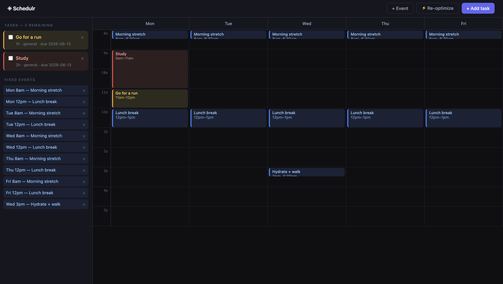
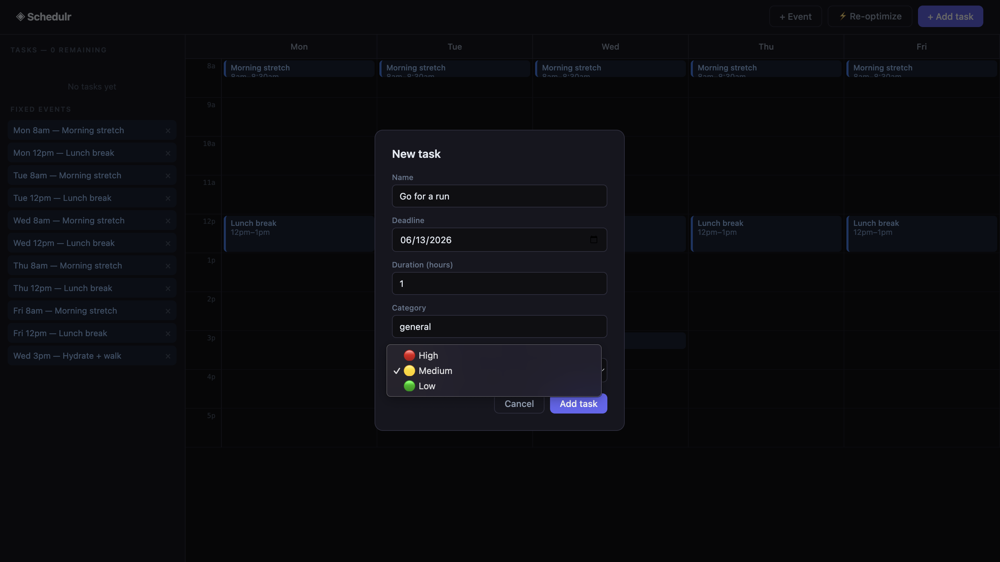
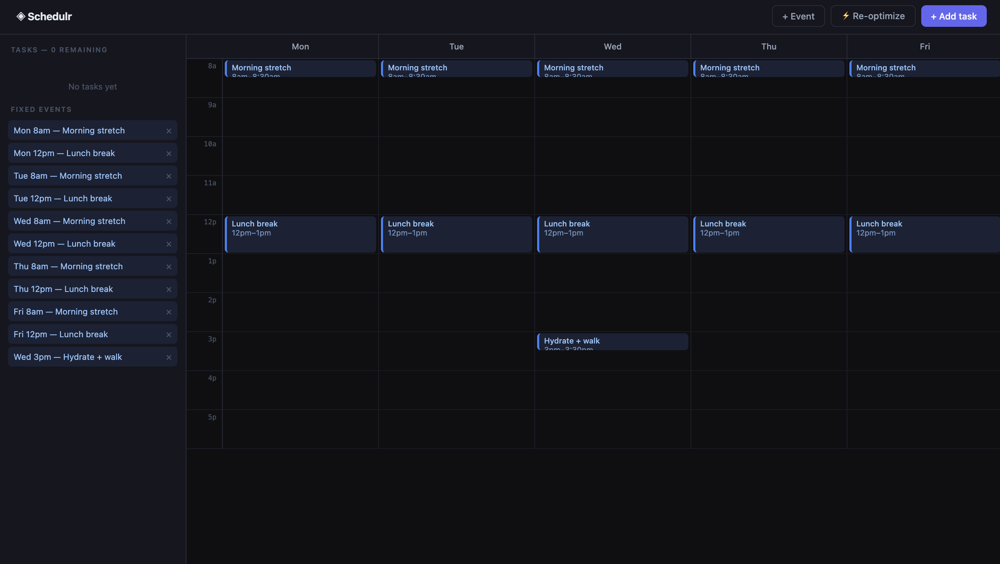
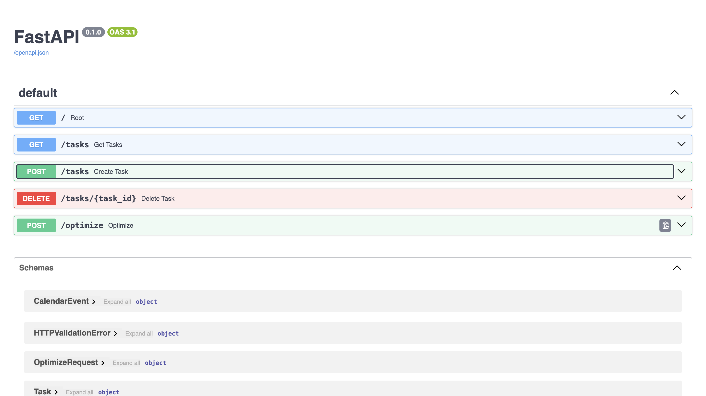
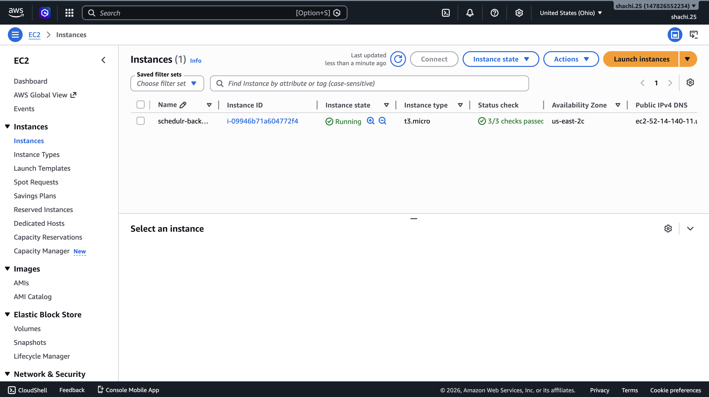

# Schedulr

Stop manually figuring out when to do things. Add your tasks, add your commitments, and Schedulr builds your week for you.
**Live**: http://schedulr-frontend-shachi.s3-website.us-east-2.amazonaws.com

---



---

## How it works

You give it tasks, with a deadline, a priority, and how long they'll take. You tell it what's already on your calendar. It runs a greedy interval scheduling algorithm, slots everything in without conflicts, and shows you your week.

If something can't fit before its deadline, it tells you instead of pretending everything is fine.

---

## Features

- Automatically schedules tasks into free slots around your fixed events
- Priority system — high, medium, low — affects scheduling order
- Add and delete tasks and fixed events
- Check off tasks as you finish them
- Re-optimize on demand if your week changes
- Tasks persist in MongoDB across sessions

---

## Screenshots

### Adding a task


### Scheduled week view


### API endpoints


### AWS EC2 instance


---

## Stack

| | |
|---|---|
| Frontend | React 18, TypeScript, Vite |
| Backend | Python 3, FastAPI |
| Database | MongoDB Atlas |
| Backend hosting | AWS EC2 (t3.micro, Ubuntu) |
| Frontend hosting | AWS S3 static site |
| HTTP | Axios |
| Validation | Pydantic |

---

## Architecture

```
React (S3)  →  FastAPI (EC2)  →  MongoDB Atlas
```

The frontend is a static Vite build served from S3. The backend runs as a systemd service on EC2 so it survives reboots. Both talk to the same MongoDB Atlas cluster.

---

## The algorithm

`backend/scheduler.py`

1. Sort tasks by deadline, break ties by priority score (high=3, med=2, low=1)
2. Walk Mon–Fri within working hours (9am–6pm)
3. Subtract fixed events and already-scheduled tasks to find free slots
4. Place each task in the first slot with enough contiguous time
5. Tasks that don't fit before their deadline come back as unscheduled

---

## API

```
GET    /tasks        fetch all tasks
POST   /tasks        create a task
DELETE /tasks/:id    delete a task
POST   /optimize     run the scheduler
```

Docs: `http://52.14.140.11:8000/docs`

---

## Run locally

```bash
# Backend
cd backend
python3 -m venv venv && source venv/bin/activate
pip install -r requirements.txt
echo "MONGO_URI=your_connection_string" > .env
uvicorn main:app --reload

# Frontend
cd frontend
npm install
npm run dev
```

---

## Roadmap

- Drag and drop to manually move tasks
- Edit tasks after creation
- Week navigation
- Google Calendar OAuth sync
- User auth
